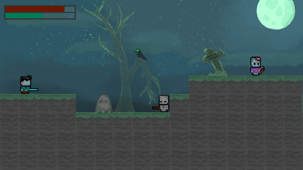

# Undead Escape
A 2D Pixel Art Platformer Game made with MonoGame

**Undead Escape** is a 2D pixel art action-platformer where you, an undead striving to retain your humanity, must battle skeletons, zombies, and powerful bosses in a cursed graveyard. Inspired by games like *Hollow Knight* and *Dead Cells*, it features intense combat, intricate platforming challenges, and a unique health mechanic. Your goal? Survive long enough to escape the undead world.

---

## Game Description

Set in a haunted graveyard, *Undead Escape* casts players as a character caught between life and death. As time ticks by, you lose humanity, symbolized by your health. Survival means balancing limited stamina, defeating enemies, and navigating dangerous terrain.

### Key Features
- **Health as Time**: The longer you remain in the undead world, the more humanity you lose. Health cannot be regained, making every second and encounter count.
- **Stamina System**: Attacks consume stamina, requiring strategic use of both melee and ranged attacks to survive.
- **Unique Combat Mechanics**: Engage in:
  - **Melee combat** for close encounters.
  - **Ranged combat** to fight enemies from a distance.
  - **Hybrid combat** combining both styles to handle challenging enemies.

### Gameplay Elements
- **Playable Character**:
  - Fluid movement controls.
  - Strategic attack options with limited stamina.
- **Enemies**:
  - **Zombies**: Slow-moving, relentless foes.
  - **Skeletons**: Agile, skilled attackers.
  - **Boss - The Lich**: A formidable, undead sorcerer guarding the graveyard’s exit.
- **Platforming Challenges**:
  - Hazardous terrains, including pitfalls and traps.
  - Varied environments requiring precise jumps and careful navigation.

## Mockup art

## Atlas
